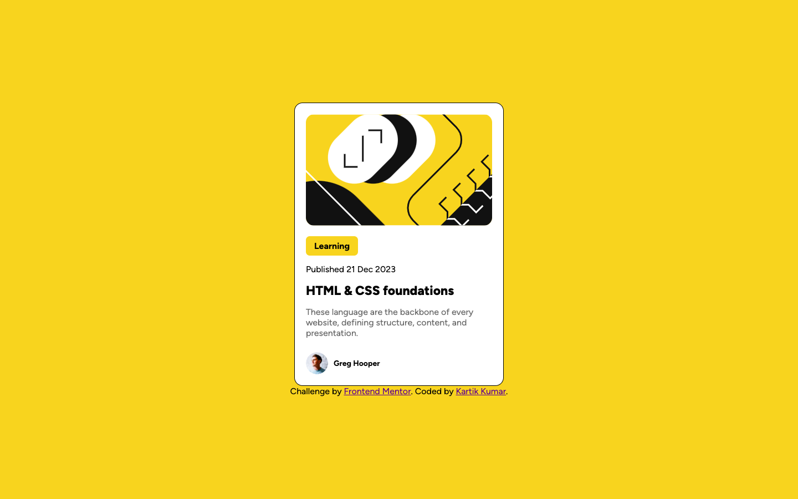

# Frontend Mentor - Blog preview card solution

This is a solution to the [Blog preview card challenge on Frontend Mentor](https://www.frontendmentor.io/challenges/blog-preview-card-ckPaj01IcS). Frontend Mentor challenges help you improve your coding skills by building realistic projects. 

## Table of contents

- [Overview](#overview)
  - [The challenge](#the-challenge)
  - [Screenshot](#screenshot)
  - [Links](#links)
- [My process](#my-process)
  - [Built with](#built-with)
  - [What I learned](#what-i-learned)
- [Author](#author)
- [Acknowledgments](#acknowledgments)

## Overview

### The challenge

Users should be able to:

- See hover and focus states for all interactive elements on the page

### Screenshot

### Links

- Solution URL: [Add solution URL here](https://your-solution-url.com)
- Live Site URL: [Add live site URL here](https://your-live-site-url.com)

## My process

### Built with

- CSS custom properties
- Flexbox
- CSS Grid

### What I learned

This project helped in to recap my learning for card type content to center vertically and horizontally.

## Author

- Frontend Mentor - [@kartikhullannavar25-hub](https://www.frontendmentor.io/profile/kartikhullannavar25-hub)
- GitHub - [@kartikhullannavar25-hub](https://github.com/kartikhullannavar25-hub)

## Acknowledgments

A huge thank you to Frontend Mentor for the amazing project prompts and designs. Their challenges gave me the perfect opportunity to practice my coding and build this real-world application.
